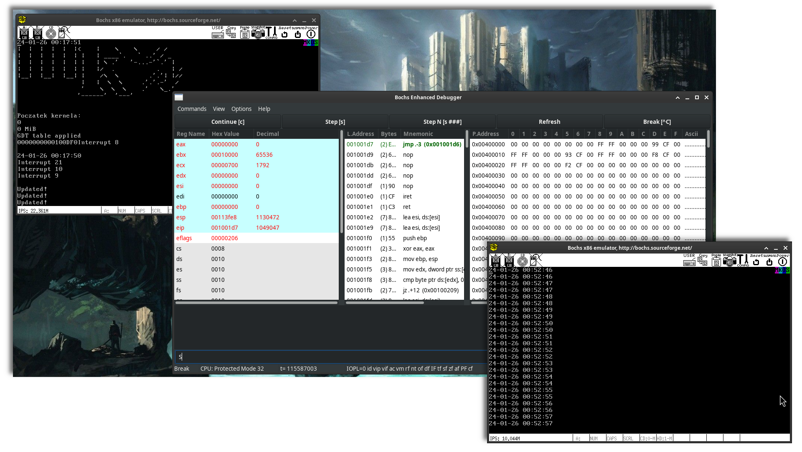

# 💾 MKOS32
MKOS32 is very basic operating system, the only thing it can do is printing current date and time twice a second.

## Steps
General list of steps which led me to the current state of project:
1. Cross compilation, preparing gcc and bintuils to compile programs for my OS
2. Loading operation system, I used GRUB and Multiboot 1 to achieve that
3. Printing text (useful for debugging), based on VGA, based on osdev wiki code, but extended with ability to:
   - scrolling text when there is no space left
   - ability to use newline character
   - printing numbers in various bases or with '0' padding
   - basic and limited printf
4. Setting up GDT to a flat memory model (currently only supported model in newer versions of GCC) - for memory protection/isolation paging should be used
   - sources/gdt.h
   - refreshing segment registers (far jump for CS)
   - placing GDT table in memory and loading it using lgdt instruction
5. Installing and setting up bochs emulator, which made debugging significantly easier
   - memory dumping
   - breakpoints (xchg %bx, %bx)
   - displaying GDT/IDT tables
6. Interruption handling
   - sources/idt.h
   - set IDT table
   - 8259A PIC initialisation (master and slave, appropriate masks etc)
   - written basic ISRs
   - loaded IDT with lidt
   - one of ISRs is used to handle clock interruptions coming from RTC (real time clock)
   - communication through ports (helper functions outb and inb)
   - RTC configuration

## Sources
I used mainly OsDev wiki, Intel x86 ISA and some other related pages as my knowledge source.:
- https://wiki.osdev.org/Bare_Bones
- https://www.intel.com/content/www/us/en/developer/articles/technical/intel-sdm.html
- https://wiki.osdev.org/What_Order_Should_I_Make_Things_In%3F
- https://wiki.osdev.org/Why_do_I_need_a_Cross_Compiler%3F
- https://wiki.osdev.org/GCC_Cross-Compiler
- https://wiki.osdev.org/Building_GCC
- https://en.wikibooks.org/wiki/X86_Assembly/GNU_assembly_syntax
- https://sourceware.org/binutils/docs/as/index.html#SEC_Contents
- https://flint.cs.yale.edu/cs421/papers/x86-asm/asm.html
- https://cs.lmu.edu/~ray/notes/gasexamples
- [AT&T syntax (1)](https://csiflabs.cs.ucdavis.edu/~ssdavis/50/att-syntax.htm)
- [AT&T syntax (2)](https://imada.sdu.dk/u/kslarsen/dm546/Material/IntelnATT.htm)
- [AT&T syntax (3)](https://blog.3mdeb.com/2018/2018-05-17-basics-of-x86-assembly/%20https://sdasgup3.github.io/Intel_Vs_Att_format/)
- [AT&T syntax (4)](https://flint.cs.yale.edu/cs421/papers/x86-asm/asm.html)
- [ISA](https://cdrdv2.intel.com/v1/dl/getContent/671200)
- [ISA (2)](https://www.felixcloutier.com/x86/)
- https://www.gnu.org/software/grub/manual/multiboot2/multiboot.html
- https://wiki.osdev.org/Multiboot
- https://wiki.osdev.org/GDT_Tutorial
- https://wiki.osdev.org/Global_Descriptor_Table
- https://wiki.osdev.org/USTAR
- https://bochs.sourceforge.io/doc/docbook/user/index.html
- https://wiki.osdev.org/Bochs
- https://www.ibiblio.org/gferg/ldp/GCC-Inline-Assembly-HOWTO.html
- https://gcc.gnu.org/onlinedocs/gcc/extensions-to-the-c-language-family/how-to-use-inline-assembly-language-in-c-code.html
- https://wiki.osdev.org/Inline_Assembly
- https://gcc.gnu.org/onlinedocs/gcc/Extended-Asm.html
- https://jsandler18.github.io/explanations/linker_ld.html
- https://ftp.gnu.org/old-gnu/Manuals/ld-2.9.1/html_chapter/ld_3.html
- https://wiki.osdev.org/IDT
- https://wiki.osdev.org/Segment_Selector
- ISA IA-32 Intel Vol 3 Chapter 6 (fragments)
- http://www.jamesmolloy.co.uk/tutorial_html/4.-The%20GDT%20and%20IDT.html
- https://wiki.osdev.org/RTC
- https://www.felixcloutier.com/x86/in
- https://www.felixcloutier.com/x86/out
- https://wiki.osdev.org/8259_PIC
- https://forum.osdev.org/viewtopic.php?f=1&t=40847
- https://forum.osdev.org/viewtopic.php?f=1&t=28900&start=15
- https://wiki.osdev.org/Interrupt
- https://wiki.osdev.org/RTC
- https://forum.osdev.org/viewtopic.php?f=1&t=30091
- http://www.walshcomptech.com/ohlandl/config/cmos_registers.html
- https://wiki.osdev.org/Formatted_Printing
- https://pubs.opengroup.org/onlinepubs/009695399/basedefs/stdarg.h
- https://cplusplus.com/reference/cstdarg/
